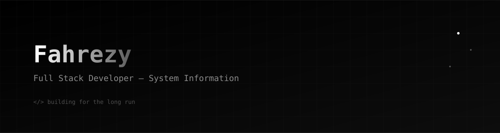
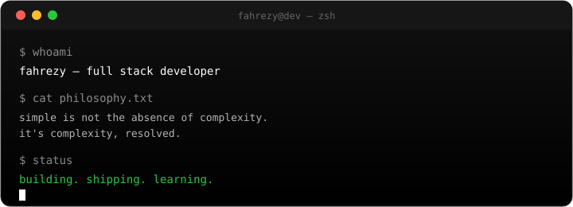

 

 

 

<i>I design systems the way I design interfaces — with intention.</i>

 

<table width="100%">
<tr>
<td width="50%" valign="top">

### About

Full stack developer focused on scalable architecture and interfaces engineered, not decorated. Sistem Informasi student shipping production-grade products end to end.

**[Read the full story →](./profile/about.md)**

</td>
<td width="50%" valign="top">

</td>
</tr>
</table>

 

 

## Stack

<b><a href="./profile/stack.md">Full breakdown →</a></b>

 

 

## Current Work

<table width="100%">
<tr>
<td width="33%" valign="top">

**EstherGarage**
 Garage Management System
  
`React` `Supabase`
 
CRM · Booking · Loyalty · Analytics

</td>
<td width="33%" valign="top">

**TikoemPoint**
 Coffee Shop POS
  
`React` `PostgreSQL`
 
POS · Inventory · Reports

</td>
<td width="33%" valign="top">

**SIPEDES**
 Village Information System
  
`Laravel` `MySQL`
 
Population Records · Letter Services

</td>
</tr>
</table>

<b><a href="./profile/projects.md">All projects →</a></b>

 

 

## Analytics

 

<b><a href="./profile/stats.md">Full analytics →</a></b>

 

 

> Simple is not the absence of complexity. It's complexity, resolved.

**[Philosophy, goals & fun facts →](./profile/philosophy.md)**

 

 

## Contact

 

Designed in Markdown. Engineered like a product.

